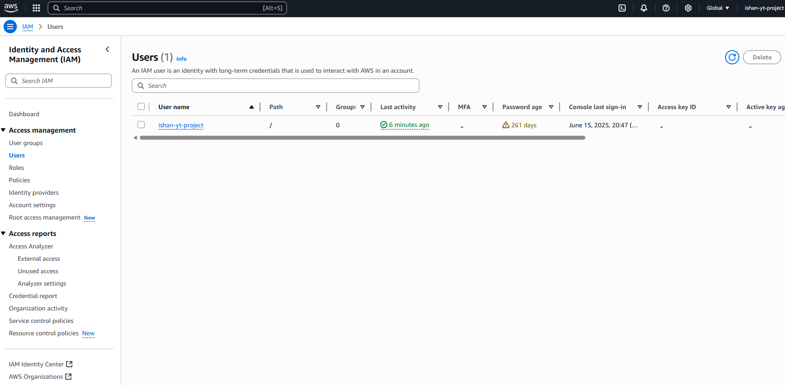
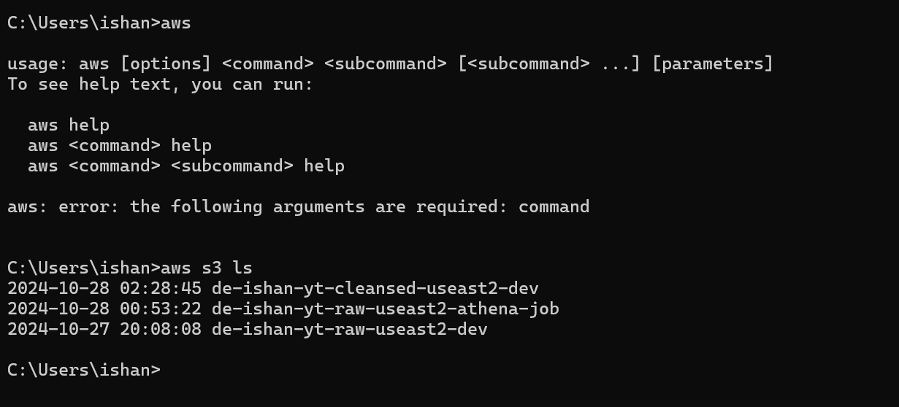
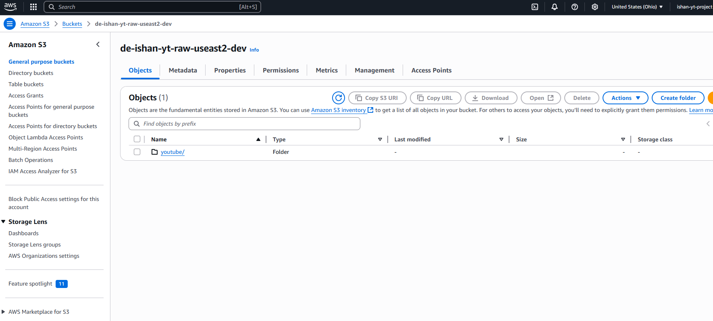
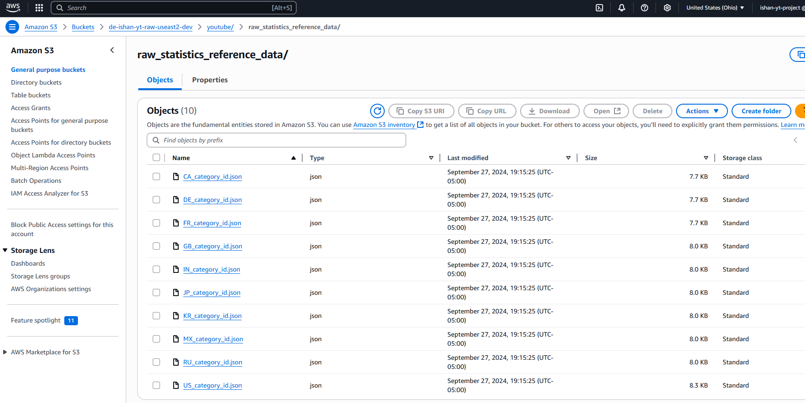
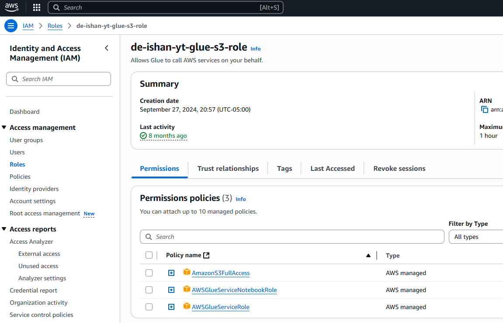
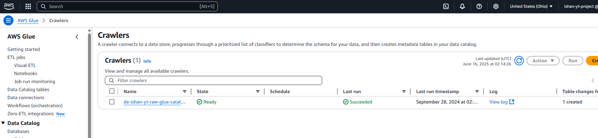
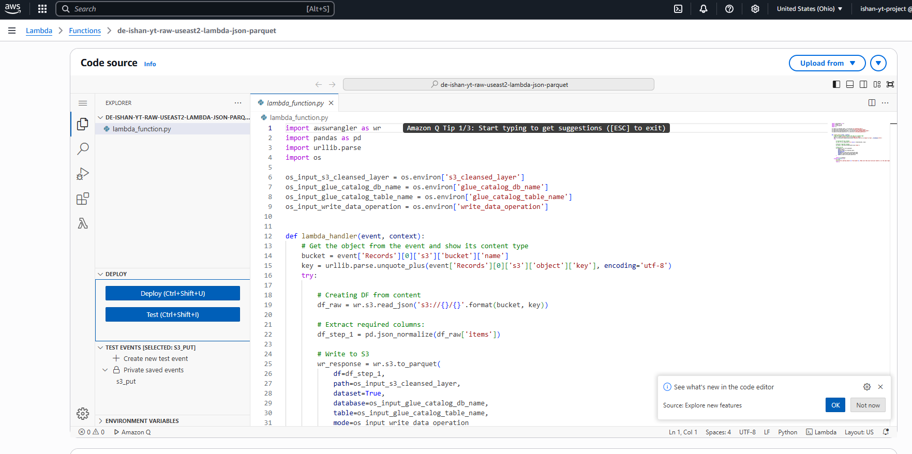
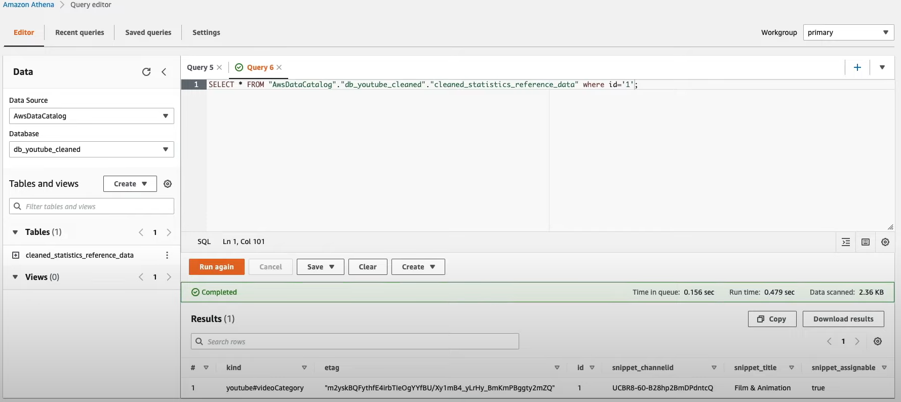
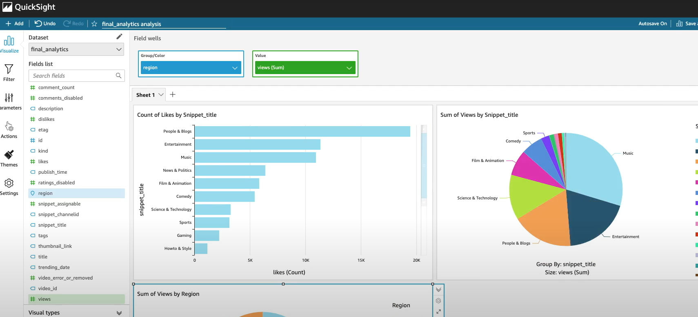

# 📊 YouTube Trending Videos – Data Engineering Project (AWS)

This project demonstrates building a cloud-native data lake and analytics pipeline on AWS using trending YouTube videos data. It involves ingesting, transforming, storing, cataloging, querying, and visualizing data using a suite of AWS services.

---

## 📌 Summary

This project showcases an end-to-end data engineering pipeline using AWS services to process and analyze YouTube trending video data. From ingestion and storage to transformation and BI, each step demonstrates best practices for modern cloud-based analytics solutions.

## 🗂 Dataset

- **Source**: [Kaggle – YouTube Trending Videos](https://www.kaggle.com/datasets/datasnaek/youtube-new)  
- **Description**: Contains trending video data by region (e.g., US, CA, IN, etc.) and reference metadata in JSON format.  
- **Collected Using**: YouTube API  

---

## 🧱 Architecture Overview

---

## 🔧 AWS Services & Workflow

### 1. **Identity Access Management (IAM)**
- Created IAM users and roles for secure access across services.
- 

### 2. **Amazon S3 (Data Lake)**
- Set up raw and reference data storage using Hive-style partitioning.
- Used AWS CLI to upload data files into appropriate S3 folders.
-   
-   
- 

### 3. **AWS Glue**
- Used Crawlers to infer schema and populate AWS Glue Data Catalog.
- Built Spark-based ETL jobs using Glue or SageMaker Notebooks.
-   
- 

### 4. **AWS Lambda**
- Processed malformed JSON reference files into tabular format.
- Set up event triggers on object creation in S3.
- 

### 5. **Amazon Athena**
- Queried the cleaned tabular data using SQL for insights and validation.
- 

### 6. **Amazon Quicksight**
- Built interactive dashboards for BI reporting and visualization.
- 

---

## 📘 What I Learned

- Designing and building a scalable **data lake** on Amazon S3
- Understanding **Data Lake vs Data Warehouse** differences
- Applying **partitioning** for cost and performance efficiency
- Using **AWS Glue** for schema discovery and Spark-based ETL
- Automating preprocessing with **Lambda** and **event triggers**
- Querying large datasets with **Athena**
- Creating **BI dashboards** using Amazon Quicksight
- Leveraging **SNS**, IAM roles, and **secure access** controls

---

## ✅ Key Features

- 🧺 Semi-structured and structured data processing
- 🔄 Automated ingestion and transformation
- 🧠 SQL-based insights via Athena and Spark
- 📊 Business-ready dashboards
- ☁️ 100% AWS-native implementation

---

